<p align="center">
  
</p>

<p align="center">
  <strong>Descubra. Avalie. Organize. Compartilhe.</strong>
</p>

<p align="center">
  Plataforma mobile de curadoria cinematográfica que conecta descoberta de filmes,
  avaliações, comunidade, Tier Lists e serviços de streaming em uma única experiência.
</p>

---

## 📌 Sobre o Projeto

O **CINEA** é um aplicativo mobile voltado para fãs de cinema e cultura pop.

A plataforma tem como objetivo centralizar diferentes etapas da experiência cinematográfica em um único ambiente, permitindo que o usuário descubra novos filmes, consulte informações sobre títulos, publique avaliações, acompanhe opiniões da comunidade, organize filmes em Tier Lists e encontre os serviços de streaming nos quais cada conteúdo está disponível.

O projeto busca transformar a curadoria pessoal de filmes em uma experiência mais **visual, social, interativa e compartilhável**.

---

## 👥 Integrantes

| Integrante | RM | Função |
|---|---|---|
| Victor Hugo de Paula | RM554787 | **Design** (Identidade Visual, UI/UX e Prototipagem) |
| Otavio Santos de Lima Ferrao | RM556452 | **Product Owner** (Gestão de Produto e Escopo) |
| Felipe Carioba | RM558447 | **Dev Front** (Implementação Mobile React Native) |
| Djalma Andrade | RM555530 | **Dev Back/Mock** (Estruturação de Dados e Lógica) |
| Lucas Rodrigues | RM556323 | **QA** (Garantia de Qualidade e Testes) |
---

## 📄 Documento de Escopo

### O Problema
Atualmente, a experiência de descobrir, avaliar e discutir filmes é fragmentada. Um usuário precisa utilizar múltiplas plataformas para pesquisar títulos, consultar opiniões, descobrir em qual streaming o conteúdo está disponível e usar ferramentas externas ou editores de imagem para criar rankings e Tier Lists. Essa fragmentação quebra a imersão e torna a curadoria pessoal um processo pouco integrado.

### Público-Alvo
* **Jovens Adultos e Cinéfilos:** Usuários ativos em redes sociais que gostam de expressar opiniões, debater cultura pop e organizar listas visuais de seus filmes favoritos.
* **Usuários Casuais de Streaming:** Pessoas que buscam otimizar o tempo na hora de escolher o que assistir, necessitando de um hub central que mostre a disponibilidade do catálogo de seus serviços assinados.

### Proposta de Valor
O CINEA transforma a curadoria pessoal em uma experiência altamente compartilhável e visual. A plataforma centraliza a jornada de ponta a ponta: do momento em que o usuário descobre um filme e verifica onde assisti-lo, até a criação nativa de Tier Lists e interação com a comunidade, eliminando a fricção entre aplicativos.

---

## 🎨 Desenvolvimento de Marca e Identidade Visual

A marca e a interface do **CINEA** foram idealizadas para transmitir a atmosfera imersiva de um cinema clássico. 

* **Nome e Logo:** O nome CINEA remete à essência do cinema com uma sonoridade premium. O conceito do logotipo brinca com o espaço negativo, onde um feixe de luz projetado por um refletor revela a silhueta de um espectador no formato da letra "A", colocando o usuário da comunidade sob os holofotes.
* **Paleta de Cores e Tipografia:** A interface utiliza um fundo degradê em tons de vermelho escuro (simulando cortinas de teatro), contrastando com detalhes funcionais e avaliações em amarelo iluminado.

---

## 📱 Protótipo no Figma

A interface e a identidade visual do **CINEA** foram desenvolvidas e prototipadas utilizando o **Figma**.

O protótipo apresenta as principais telas e fluxos planejados para o aplicativo, permitindo visualizar a experiência do usuário antes da implementação em React Native.

### Telas desenvolvidas

- Tela de Login;
- Tela Inicial;
- Tela de Filme;
- Tela de Avaliações;
- Tela de Avaliação;
- Tela de Pesquisa;
- Tela de Usuário;
- Menu do Usuário;
- Tela de Tier List.

### Acessar o protótipo

<p align="center">
  <a href="https://www.figma.com/design/YkjmqKSaibpFj0yNBNTiOU/CINEA---Mobile-Development-and-IoT?node-id=0-1&p=f">
    <strong>🎨 Visualizar protótipo no Figma</strong>
  </a>
</p>

---

## 🚀 Evolução — CP5

O **CP5** representa a evolução do protótipo visual do CINEA para um protótipo funcional mobile, com foco em experiência real do usuário e integração com dados persistidos.

Nesta etapa, o projeto avançou para fluxos reais de navegação e persistência, contando com:

- navegação funcional entre telas;
- autenticação real com Supabase Auth;
- cadastro;
- login;
- logout;
- persistência de sessão;
- perfil real do usuário;
- upload e persistência de avatar;
- catálogo local de filmes;
- busca por títulos;
- Movie Details;
- criação e visualização de avaliações;
- persistência de reviews no Supabase;
- listagem das avaliações publicadas pelo usuário;
- Profile refletindo apenas filmes realmente avaliados;
- seleção de filme antes de criar uma review;
- criação de múltiplas Tier Lists;
- alternância entre Tier Lists;
- edição de Tier Lists;
- exclusão de Tier Lists com confirmação;
- persistência de Tier Lists e seus itens;
- RLS para proteção dos dados;
- Supabase Storage para avatar;
- execução e validação em Android Emulator.

---

## 🛠️ Tecnologias e Bibliotecas

As tecnologias e bibliotecas abaixo representam o stack efetivamente utilizado no estado atual do CP5.

### Mobile
- React Native
- Expo SDK 54
- TypeScript

### Navegação
- React Navigation
- Native Stack
- Bottom Tabs utilizadas internamente na arquitetura de navegação

### Backend e Persistência
- Supabase
- Supabase Auth
- PostgreSQL
- Supabase Storage
- Row Level Security (RLS)

### Bibliotecas relevantes
- @supabase/supabase-js
- @react-native-async-storage/async-storage
- react-native-url-polyfill
- expo-image-picker
- react-native-safe-area-context
- react-native-screens

---

## 💼 Ideia de Venda (Pitch)

### Modelo de Negócios
Para garantir viabilidade e rápida adoção, o CINEA operará em um modelo híbrido:
1. **Freemium:** Acesso gratuito às ferramentas centrais da comunidade (avaliar filmes, buscar streamings, criar um número limitado de Tier Lists).
2. **Assinatura Premium:** Plano mensal voltado a *heavy users*, liberando Tier Lists ilimitadas, customização avançada de perfil e exportação em alta resolução sem anúncios.
3. **Afiliados (B2B):** Monetização via comissionamento (CPA) ao redirecionar usuários para a assinatura de serviços de streaming parceiros.

### Diferencial Competitivo
Enquanto as plataformas do mercado atual se limitam a listas textuais e notas numéricas, o CINEA integra a criação de **Tier Lists Nativas**. Isso gera um formato visual dinâmico, pronto para exportação e desenhado para o compartilhamento orgânico em redes sociais, mantendo o usuário engajado sem precisar de softwares de terceiros.

---

## ⚙️ Como Rodar o Projeto

O desenvolvimento mobile do CP5 foi conduzido com **React Native** e **Expo**, mantendo a identidade visual do projeto e adicionando fluxos reais de autenticação, persistência e navegação.

**Instruções Básicas para rodar o projeto:**
```bash
# Clone o repositório
git clone https://github.com/djxlma/Cinea_App

# Acesse o diretório do app
cd Cinea_App/cinea

# Instale as dependências
npm install

# Crie o arquivo de ambiente a partir do exemplo
# copie .env.example para .env

# Inicie a aplicação
npx expo start
```

Para Windows, a execução pode ser feita com:

```bash
npx.cmd expo start
```

Validação TypeScript:

```bash
npx.cmd tsc --noEmit
```

O app pode ser executado diretamente pelo Expo em um emulador Android Studio com Pixel 6.

### Configuração do ambiente

As variáveis abaixo devem ser configuradas em `.env` usando `.env.example` como referência:

- `EXPO_PUBLIC_SUPABASE_URL`
- `EXPO_PUBLIC_SUPABASE_ANON_KEY`

Observações:
- o arquivo `.env` não deve ser versionado;
- `.env.example` pode ser versionado como template;
- `service_role` não é usada no app mobile;
- não devem ser inseridas credenciais reais no repositório.

### Estrutura de Pastas
A estrutura atual do projeto foi organizada para o protótipo funcional do CP5:

```text
cinea/
├── assets/
│   └── posters/
├── design-reference/
├── docs/
│   └── test-plan.md
├── src/
│   ├── components/
│   ├── data/
│   ├── lib/
│   ├── navigation/
│   ├── screens/
│   ├── services/
│   ├── tokens/
│   └── types/
├── supabase/
│   ├── schema.sql
│   └── rls.sql
├── .env.example
├── App.tsx
└── package.json
```

Descrição resumida:

- `components`: componentes reutilizáveis da interface;
- `data`: catálogo local controlado usado no CP5;
- `lib`: configuração e cliente do Supabase;
- `navigation`: stacks e rotas;
- `screens`: telas organizadas por domínio;
- `services`: acesso ao Supabase e regras de persistência;
- `tokens`: identidade visual e constantes de estilo;
- `types`: tipos TypeScript;
- `design-reference`: referência visual do Figma;
- `docs`: documentação e plano de testes;
- `supabase`: schema e políticas RLS versionadas.

## 🗄️ Banco de Dados

O app trabalha com as tabelas abaixo do Supabase:

### profiles
- `id`
- `username`
- `display_name`
- `bio`
- `avatar_url`
- `created_at`

### reviews
- `id`
- `user_id`
- `movie_id`
- `movie_title`
- `rating`
- `content`
- `created_at`

### tier_lists
- `id`
- `user_id`
- `title`
- `description`
- `created_at`
- `updated_at`

### tier_list_items
- `id`
- `tier_list_id`
- `movie_id`
- `movie_title`
- `tier`
- `position`

Resumo do relacionamento:

- `profiles.id` corresponde ao usuário autenticado;
- `reviews` pertencem a um usuário;
- `tier_lists` pertencem a um usuário;
- `tier_list_items` pertencem a uma Tier List;
- a remoção de uma Tier List remove seus itens conforme o relacionamento configurado no banco.

Referências do projeto:

- `supabase/schema.sql`
- `supabase/rls.sql`

## 🔐 Segurança

A aplicação utiliza **Row Level Security** nos dados sensíveis do app. As regras implementadas no CP5 visam garantir que:

- usuários possam criar, atualizar e excluir apenas seus próprios dados;
- reviews ficam associadas ao usuário autenticado;
- Tier Lists ficam associadas ao usuário autenticado;
- `tier_list_items` dependem da ownership da Tier List pai;
- o avatar usa pasta baseada no `user_id`;
- a aplicação mobile não utiliza `service_role`;
- a sessão é gerenciada pelo Supabase Auth;
- credenciais reais não são versionadas.

## 👤 Perfil e Avatar

O Profile do CINEA utiliza dados reais da tabela `profiles`.

A experiência atual inclui:

- carregamento de nome e username reais;
- escolha de foto da galeria por meio do `expo-image-picker`;
- envio do avatar para o bucket privado `avatars`;
- estrutura de armazenamento baseada no `user_id`;
- persistência em `profiles.avatar_url`;
- uso de signed URL temporária para exibição;
- fallback visual de guest quando o usuário não possui foto;
- reutilização do avatar em Profile, Home e UserMenu.

## 🎬 Catálogo do Protótipo

O CP5 usa um catálogo local controlado para validar os fluxos funcionais do app.

Filmes disponíveis no catálogo atual:

- Duna: Parte Dois
- Oppenheimer
- A Viagem de Chihiro
- Parasita

Esse catálogo é utilizado em:

- Home;
- Search;
- Movie Details;
- seleção de filme para avaliação;
- Profile;
- Tier Lists.

Essa abordagem foi escolhida de forma intencional para priorizar o funcionamento do protótipo funcional no CP5. Integração com API pública de filmes pode ser considerada em etapas futuras.

## 📝 Avaliações

As reviews do CINEA são persistidas de forma real no Supabase.

O fluxo atual é:

- o usuário escolhe o filme;
- seleciona nota de 1 a 5 estrelas;
- escreve comentário;
- a review é persistida em `reviews`;
- as avaliações de um filme são carregadas pelo `movie_id`;
- "Minhas avaliações" utiliza as reviews do usuário autenticado;
- o Profile mostra apenas filmes realmente avaliados;
- os dados permanecem disponíveis após reinício e login.

## 🏆 Tier Lists

O CP5 permite que o usuário:

- crie Tier Lists;
- possua múltiplas Tier Lists;
- alterne entre listas;
- organize filmes nas categorias S/A/B/C/D;
- edite uma Tier List;
- exclua com confirmação;
- persista lista e itens no Supabase;
- recupere os dados após novo acesso.

Se houver algum botão visual de exportação em determinadas telas, ele deve ser interpretado apenas como parte do protótipo visual e não como funcionalidade concluída do produto final.

## 🧪 Testes

O projeto já conta com um plano de testes manual documentado no arquivo:

[Plano de Testes do CP5](./cinea/docs/test-plan.md)

Esse plano cobre cenários de:

- autenticação;
- cadastro/login/logout;
- persistência de sessão;
- Profile;
- avatar;
- Home;
- Search;
- Movie Details;
- Reviews;
- Tier Lists;
- RLS;
- navegação;
- estados vazios;
- persistência de dados.

Não há suíte automatizada documentada neste momento.

## 📸 Evidências do CP5

### 🔐 Autenticação

<p align="center">
  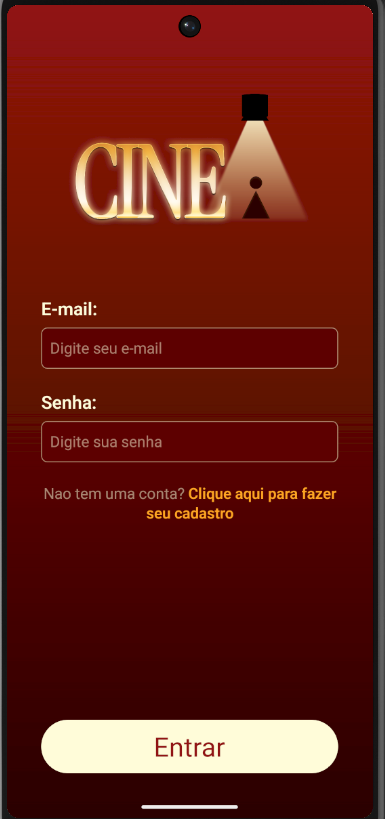
  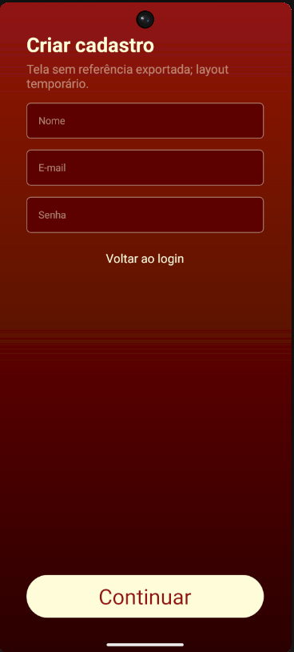
</p>

### 🏠 Descoberta de Filmes

<p align="center">
  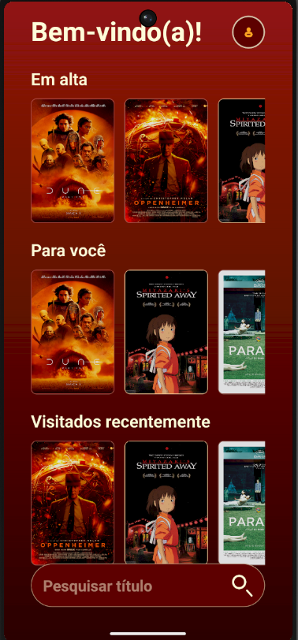
  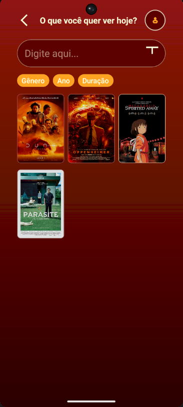
  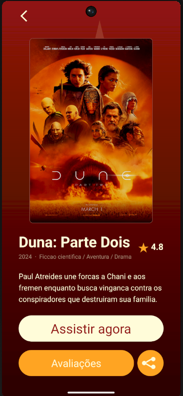
</p>

### ⭐ Avaliações

<p align="center">
  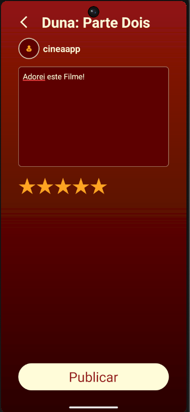
  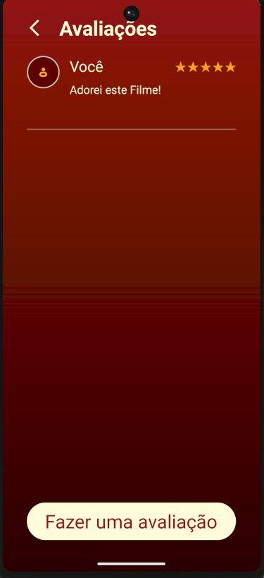
  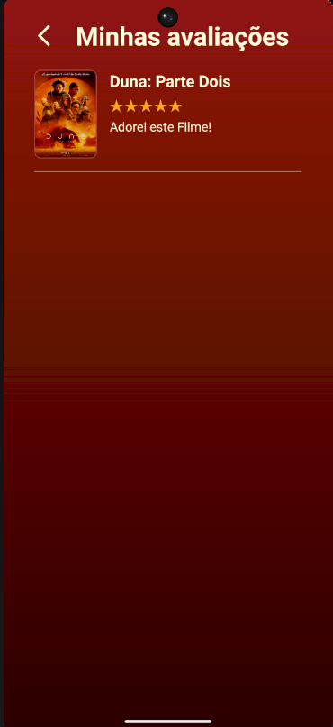
</p>

### 👤 Perfil

<p align="center">
  
</p>

### 🏆 Tier Lists

<p align="center">
  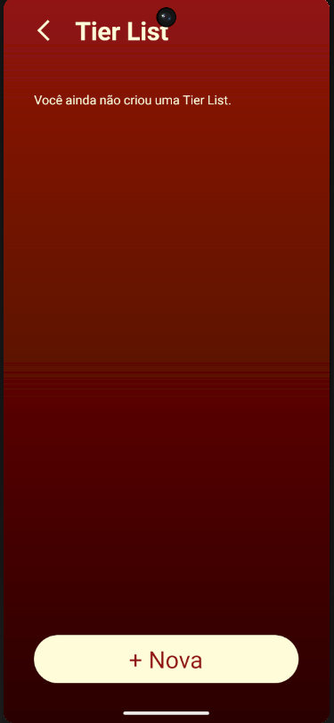
  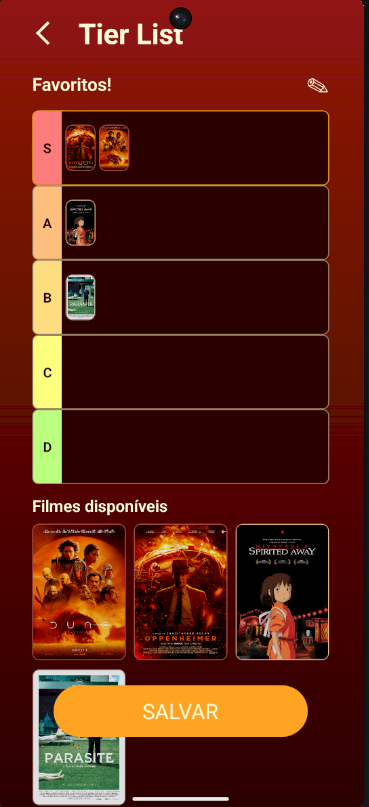
  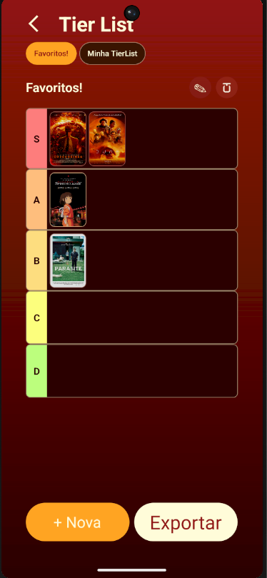
</p>

### 🗄️ Persistência no Supabase

<p align="center">
  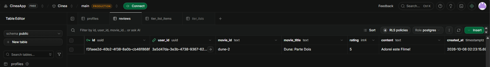
  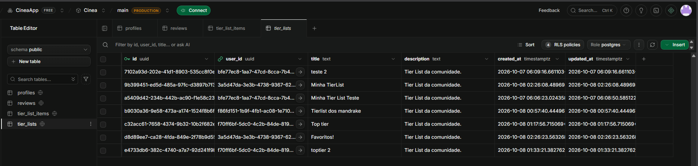
</p>

<p align="center">
  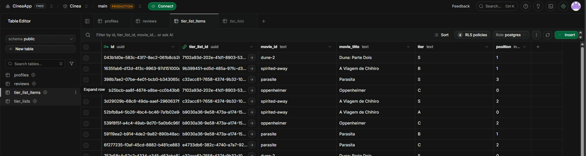
</p>

### 🔐 Segurança / RLS

<p align="center">
  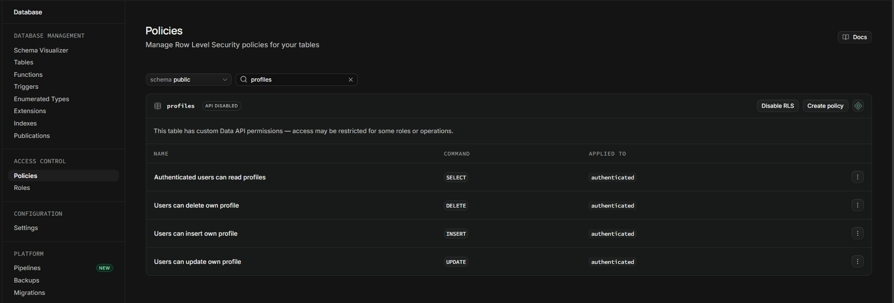
</p>

> As capturas do Supabase devem ocultar informações sensíveis, como credenciais, tokens, chaves e dados pessoais.

## 🧠 Decisões Técnicas

O CP5 foi arquitetado com alguns princípios técnicos centrais:

- Expo foi utilizado para acelerar desenvolvimento, execução e testes;
- TypeScript foi utilizado para tipagem e manutenção;
- React Navigation organiza os fluxos entre telas;
- Supabase concentra Auth, PostgreSQL, Storage e RLS;
- o catálogo local foi escolhido para priorizar o funcionamento dos fluxos do protótipo;
- acesso a dados foi isolado em services;
- componentes reutilizáveis mantêm consistência visual;
- schema e RLS são versionados para reprodutibilidade;
- design-reference preserva a referência visual criada no Figma.

## ⚠️ Limitações atuais

O estado atual do projeto possui algumas limitações reais que devem ser entendidas como parte do escopo do CP5:

- catálogo de filmes ainda é local;
- ainda não existe integração com TMDB ou API pública de filmes;
- Conexões ainda não está implementado;
- Configurações do aplicativo ainda não está implementado;
- exportação de Tier List permanece condicionada ao protótipo visual, se não houver implementação completa;
- APK final será tratada em etapas futuras;
- testes do CP5 são predominantemente manuais e documentados.

## 🔜 Próximos Passos — CP6

- refinamento final de funcionalidades;
- integração opcional com API pública/TMDB;
- conclusão dos recursos restantes;
- testes finais de estabilidade;
- documentação final;
- geração de APK via Expo/EAS ou Android Studio.

---

> O CP5 representa a evolução do protótipo visual do CINEA para um protótipo funcional mobile, mantendo a identidade definida no Figma e incorporando autenticação, persistência de dados e fluxos reais com Supabase.

---
